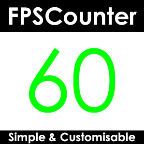

 

# FPSCounter

FPSCounter is a mod for the game [Teardown](https://teardowngame.com/) which provides a simple and customisable FPS counter/display.
It is available on the [Steam Workshop](https://steamcommunity.com/sharedfiles/filedetails/?id=2468900409).

 

